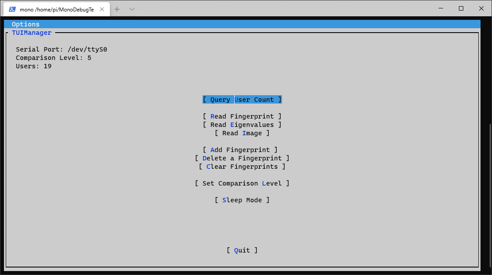

# Sample App

A sample app for the [Waveshare UART fingerprint sensor (C) library](../README.md)

## Build

You can compile it using any **C# IDE** that supports **.Net Framework** or by running
`dotnet build` in a **terminal** using [**.Net CLI**](https://docs.microsoft.com/en-us/dotnet/core/tools/)

## Usage

- Install [**Mono**](https://www.mono-project.com/) on your Raspberry Pi
- [**Download**](https://github.com/Eveldee/WaveshareUARTFingerprintSensor/releases) or [**Build**](#build) the application
- Run it with `mono WaveshareUARTFingerprintSensor.Sample.exe`

## Copyright and license

[**WaveshareUARTFingerprintSensor**](../README.md) library is licensed under the [MIT License](../LICENSE).

[**gui.cs**](https://github.com/migueldeicaza/gui.cs/) library is under the [MIT License](https://github.com/migueldeicaza/gui.cs/blob/master/LICENSE).
